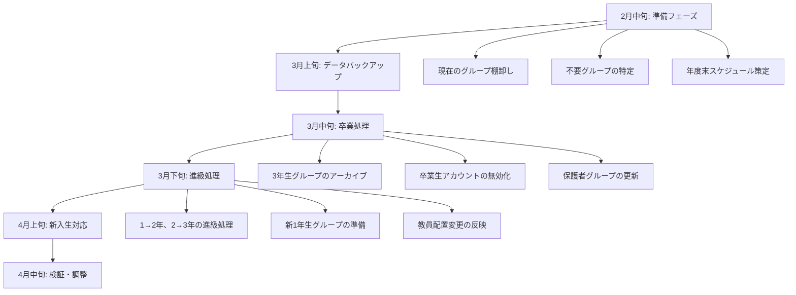

# 📁 Microsoft 365 グループ管理

## 📋 概要

このドキュメントでは、教育機関におけるMicrosoft 365のグループ管理について詳しく説明します。効率的なグループ管理、適切な権限設定、そして教育現場に適したベストプラクティスを提供します。

## 🏫 教育機関におけるグループ管理の重要性

### 教育現場特有の課題

教育機関では以下のような特有の要件があります。

- **学年・クラス単位**での組織管理
- **教科・部活動**での横断的なグループ
- **学期・年度**での定期的なメンバー変更
- **教員・生徒・保護者**の異なる権限レベル
- **個人情報保護**の厳格な管理要件

### Microsoft 365グループの教育的価値

- **協働学習の促進**：チームでのプロジェクト作業
- **情報共有の効率化**：クラス・学年間での連絡事項
- **リソース管理**：教材・課題の配布と回収
- **コミュニケーション強化**：教員間・保護者との連携

## 🔍 Microsoft 365グループとセキュリティグループの使い分け

### Microsoft 365グループ

#### 📋 特徴
- **統合されたサービス**：Teams、SharePoint、Exchange、OneNoteが自動的に作成
- **コラボレーション重視**：共同作業とコミュニケーションが主目的
- **動的なメンバーシップ**：ユーザーが自由に参加・脱退可能（設定により制限可能）
- **豊富な機能**：カレンダー、ノートブック、ファイル共有、会話

#### 🎓 教育機関での活用例

```
【クラス運営】
- クラス用Microsoft 365グループ
  └── Teams: 授業・HR
  └── SharePoint: 教材・課題
  └── Exchange: 連絡事項
  └── OneNote: クラスノート

【教科指導】
- 数学科Microsoft 365グループ
  └── Teams: 教科会議
  └── SharePoint: 指導案・教材
  └── Exchange: 教科連絡
  └── OneNote: 授業記録

【部活動・委員会】
- 生徒会Microsoft 365グループ
  └── Teams: 会議・打合せ
  └── SharePoint: 資料・議事録
  └── Exchange: 活動連絡
  └── OneNote: 活動記録
```

#### ⚙️ 作成と設定例

```powershell
# クラス用Microsoft 365グループの作成
Connect-MgGraph -Scopes "Group.ReadWrite.All"

$groupParams = @{
    DisplayName = "3年A組 - 2024年度"
    MailNickname = "class-3a-2024"
    Description = "3年A組のクラス運営用グループ"
    GroupTypes = @("Unified")
    MailEnabled = $true
    SecurityEnabled = $false
    Visibility = "Private"
}

$group = New-MgGroup @groupParams

# チーム機能の有効化
$teamParams = @{
    "template@odata.bind" = "https://graph.microsoft.com/v1.0/teamsTemplates('educationClass')"
    DisplayName = "3年A組 - 2024年度"
    Description = "3年A組のクラス運営用チーム"
}

New-MgTeam -GroupId $group.Id -BodyParameter $teamParams
```

### セキュリティグループ

#### 📋 特徴
- **アクセス制御専用**：リソースへのアクセス権限管理が主目的
- **シンプルな構造**：メンバーリストのみ
- **高いセキュリティ**：管理者によるメンバー管理
- **システム統合**：オンプレミスADとの同期可能

#### 🔐 教育機関での活用例

```
【職種別アクセス制御】
- 教員グループ
  └── 成績管理システムアクセス
  └── 教務システムアクセス
  └── 職員室SharePointアクセス

- 事務職員グループ
  └── 人事システムアクセス
  └── 財務システムアクセス
  └── 事務室SharePointアクセス

【学年別アクセス制御】
- 1年生グループ
  └── 1年生用教材アクセス
  └── 1年生用アプリケーション

- 3年生グループ
  └── 進路情報システムアクセス
  └── 3年生専用リソース
```

#### ⚙️ 作成と設定例

```powershell
# セキュリティグループの作成
$securityGroupParams = @{
    DisplayName = "教員_成績管理システム_アクセス"
    MailNickname = "teachers-gradebook-access"
    Description = "成績管理システムにアクセス可能な教員"
    GroupTypes = @()
    MailEnabled = $false
    SecurityEnabled = $true
}

$secGroup = New-MgGroup @securityGroupParams

# メンバーの追加
$teacherIds = @(
    "teacher1@school.edu.jp",
    "teacher2@school.edu.jp"
)

foreach ($teacherId in $teacherIds) {
    $user = Get-MgUser -Filter "userPrincipalName eq '$teacherId'"
    New-MgGroupMember -GroupId $secGroup.Id -DirectoryObjectId $user.Id
}
```

### 🤔 選択基準

| 用途 | Microsoft 365グループ | セキュリティグループ |
|------|---------------------|-------------------|
| **クラス運営** | ✅ 推奨 | ❌ |
| **教科指導** | ✅ 推奨 | ❌ |
| **部活動・委員会** | ✅ 推奨 | ❌ |
| **システムアクセス制御** | ❌ | ✅ 推奨 |
| **アプリケーション権限** | ❌ | ✅ 推奨 |
| **一時的なプロジェクト** | ✅ 推奨 | ❌ |
| **恒久的な職種別管理** | ❌ | ✅ 推奨 |

## 🚫 グループ作成権限の制限

### なぜ制限が必要か

教育機関では以下の理由でグループ作成権限を制限する必要があります：

- **ガバナンス強化**：無秩序なグループ増加の防止
- **セキュリティ確保**：不適切な情報共有の防止
- **管理効率化**：管理すべきグループ数の適正化
- **コンプライアンス**：教育データ保護法への準拠

### 制限レベルの設定

#### レベル1：完全制限（推奨：小中学校）
- **対象**：全ユーザー
- **制限内容**：Microsoft 365グループ作成禁止
- **作成者**：IT管理者のみ

```powershell
# グループ作成権限の完全制限
Connect-MgGraph -Scopes "Policy.ReadWrite.Authorization", "Directory.ReadWrite.All"

# グループ設定テンプレートの取得
$template = Get-MgDirectorySettingTemplate | Where-Object {$_.DisplayName -eq "Group.Unified"}

# 設定の作成
$setting = @{
    TemplateId = $template.Id
    Values = @(
        @{
            Name = "EnableGroupCreation"
            Value = "false"
        }
    )
}

New-MgDirectorySetting -BodyParameter $setting
```

#### レベル2：教員限定（推奨：高等学校）
- **対象**：教員のみ
- **制限内容**：生徒はグループ作成禁止
- **作成者**：教員・IT管理者

```powershell
# 教員用セキュリティグループの作成
$teacherGroupParams = @{
    DisplayName = "Microsoft365グループ作成権限_教員"
    MailNickname = "group-creators-teachers"
    Description = "Microsoft 365グループを作成できる教員"
    GroupTypes = @()
    MailEnabled = $false
    SecurityEnabled = $true
}

$teacherGroup = New-MgGroup @teacherGroupParams

# グループ作成権限を教員グループに限定
$setting = @{
    TemplateId = $template.Id
    Values = @(
        @{
            Name = "EnableGroupCreation"
            Value = "false"
        },
        @{
            Name = "GroupCreationAllowedGroupId"
            Value = $teacherGroup.Id
        }
    )
}

New-MgDirectorySetting -BodyParameter $setting
```

#### レベル3：承認制（推奨：大学）
- **対象**：全ユーザー
- **制限内容**：作成時に承認が必要
- **作成者**：承認された全ユーザー

```powershell
# 承認ワークフローの設定（Microsoft Graph APIを使用）
$approvalPolicy = @{
    DisplayName = "Microsoft 365グループ作成承認"
    Description = "新しいMicrosoft 365グループ作成時の承認プロセス"
    RequestApprovalSettings = @{
        IsApprovalRequired = $true
        ApprovalStages = @(
            @{
                ApprovalStageTimeOutInDays = 7
                IsApproverJustificationRequired = $true
                PrimaryApprovers = @(
                    @{
                        "@odata.type" = "#microsoft.graph.singleUser"
                        UserId = "it-admin@school.edu.jp"
                    }
                )
            }
        )
    }
}
```

### 段階的展開戦略（GIGAスクール構想対応）

#### 🎯 第1フェーズ：基盤構築（1-2ヶ月）

**目標**：安全な環境の確立
```powershell
# Phase 1: 完全制限からスタート
function Start-Phase1GroupRestriction {
    Write-Host "🔒 第1フェーズ：完全なグループ作成制限を開始" -ForegroundColor Yellow
    
    # 1. 現在の設定確認
    $currentSetting = Get-MgDirectorySetting | Where-Object {$_.DisplayName -eq "Group.Unified"}
    if ($currentSetting) {
        Write-Host "既存の設定が検出されました。更新します。"
    }
    
    # 2. IT管理者グループの作成
    $adminGroup = @{
        DisplayName = "M365管理者_グループ作成権限"
        MailNickname = "m365-admin-group-creators"
        Description = "Microsoft 365グループ作成権限を持つ管理者"
        GroupTypes = @()
        MailEnabled = $false
        SecurityEnabled = $true
    }
    
    $adminGroupResult = New-MgGroup @adminGroup
    
    # 3. IT管理者をメンバーに追加
    $adminUsers = @(
        "it-admin1@school.onmicrosoft.com",
        "it-admin2@school.onmicrosoft.com"
    )
    
    foreach ($admin in $adminUsers) {
        try {
            $user = Get-MgUser -Filter "userPrincipalName eq '$admin'"
            if ($user) {
                New-MgGroupMember -GroupId $adminGroupResult.Id -DirectoryObjectId $user.Id
                Write-Host "✅ 管理者を追加: $admin"
            }
        } catch {
            Write-Host "⚠️ 管理者の追加に失敗: $admin - $($_.Exception.Message)"
        }
    }
    
    # 4. グループ作成制限を適用
    $template = Get-MgDirectorySettingTemplate | Where-Object {$_.DisplayName -eq "Group.Unified"}
    $restrictionSetting = @{
        TemplateId = $template.Id
        Values = @(
            @{Name = "EnableGroupCreation"; Value = "false"},
            @{Name = "GroupCreationAllowedGroupId"; Value = $adminGroupResult.Id},
            @{Name = "EnableMSStandardBlockedWords"; Value = "true"},
            @{Name = "PrefixSuffixNamingRequirement"; Value = "[学校コード]_[GroupName]_[年度]"},
            @{Name = "AllowGuestsToBeGroupOwner"; Value = "false"},
            @{Name = "AllowGuestsToAccessGroups"; Value = "false"},
            @{Name = "AllowToAddGuests"; Value = "false"},
            @{Name = "UsageGuidelinesUrl"; Value = "https://school.example.com/group-usage-guidelines"}
        )
    }
    
    if ($currentSetting) {
        Update-MgDirectorySetting -DirectorySettingId $currentSetting.Id -Values $restrictionSetting.Values
    } else {
        New-MgDirectorySetting @restrictionSetting
    }
    
    Write-Host "✅ 第1フェーズ完了：グループ作成権限を管理者のみに制限しました" -ForegroundColor Green
}
```

#### 🎓 第2フェーズ：教員への段階的開放（2-4ヶ月）

**目標**：教育現場でのグループ活用開始
```powershell
# Phase 2: 教員への権限拡大
function Start-Phase2TeacherAccess {
    Write-Host "👨‍🏫 第2フェーズ：教員への段階的権限付与を開始" -ForegroundColor Blue
    
    # 1. 教員用グループ作成権限グループの作成
    $teacherCreatorGroup = @{
        DisplayName = "教員_グループ作成権限"
        MailNickname = "teachers-group-creators"
        Description = "Microsoft 365グループを作成できる教員"
        GroupTypes = @()
        MailEnabled = $false
        SecurityEnabled = $true
    }
    
    $teacherGroup = New-MgGroup @teacherCreatorGroup
    
    # 2. 段階的な教員追加戦略
    $teacherCategories = @{
        "管理職" = @("principal@school.onmicrosoft.com", "vice-principal@school.onmicrosoft.com")
        "学年主任" = @("grade1-head@school.onmicrosoft.com", "grade2-head@school.onmicrosoft.com", "grade3-head@school.onmicrosoft.com")
        "教科主任" = @("math-head@school.onmicrosoft.com", "english-head@school.onmicrosoft.com", "science-head@school.onmicrosoft.com")
        "ICT推進担当" = @("ict-leader1@school.onmicrosoft.com", "ict-leader2@school.onmicrosoft.com")
    }
    
    # 3. 段階的に教員を追加（週次で実施）
    $week = 1
    foreach ($category in $teacherCategories.GetEnumerator()) {
        Write-Host "第${week}週: $($category.Key)への権限付与" -ForegroundColor Cyan
        
        foreach ($teacher in $category.Value) {
            try {
                $user = Get-MgUser -Filter "userPrincipalName eq '$teacher'"
                if ($user) {
                    New-MgGroupMember -GroupId $teacherGroup.Id -DirectoryObjectId $user.Id
                    Write-Host "  ✅ 追加: $teacher"
                    
                    # 教員への通知メール送信
                    Send-WelcomeNotification -UserEmail $teacher -Phase "Phase2"
                }
            } catch {
                Write-Host "  ⚠️ 追加失敗: $teacher - $($_.Exception.Message)"
            }
        }
        $week++
        
        # 週次レビューポイント
        Write-Host "📊 第${week}週レビュー実施推奨" -ForegroundColor Yellow
    }
    
    # 4. グループ作成権限の更新
    $currentSetting = Get-MgDirectorySetting | Where-Object {$_.DisplayName -eq "Group.Unified"}
    $adminGroupId = ($currentSetting.Values | Where-Object {$_.Name -eq "GroupCreationAllowedGroupId"}).Value
    
    # 既存の管理者グループに教員グループのメンバーを追加
    $teacherMembers = Get-MgGroupMember -GroupId $teacherGroup.Id
    foreach ($member in $teacherMembers) {
        try {
            New-MgGroupMember -GroupId $adminGroupId -DirectoryObjectId $member.Id
        } catch {
            # 既に追加済みの場合は無視
        }
    }
    
    Write-Host "✅ 第2フェーズ完了：教員にグループ作成権限を付与しました" -ForegroundColor Green
}

# 教員向け通知メールの送信
function Send-WelcomeNotification {
    param(
        [string]$UserEmail,
        [string]$Phase
    )
    
    $subject = "Microsoft 365グループ作成権限の付与について"
    $body = @"
$UserEmail 様

Microsoft 365グループ作成権限が付与されました。

【利用可能な機能】
- クラス・教科・部活動用のTeamsチーム作成
- SharePointサイトの自動作成
- グループメールの活用

【重要な注意事項】
- グループ名は命名規則に従ってください
- 生徒の個人情報保護に配慮してください
- 不要なグループは定期的に削除してください

【サポート】
ご不明な点は IT管理部門までお問い合わせください。

Microsoft 365管理チーム
"@

    # 実際のメール送信処理はここに実装
    Write-Host "📧 通知メール送信: $UserEmail"
}
```

#### 🚀 第3フェーズ：全面展開（4-6ヶ月）

**目標**：組織全体での効果的な運用
```powershell
# Phase 3: 全面展開と運用最適化
function Start-Phase3FullDeployment {
    Write-Host "🚀 第3フェーズ：全面展開を開始" -ForegroundColor Green
    
    # 1. 全教員への権限付与
    $allTeachers = Get-MgUser -Filter "department eq '教員'" -All
    $teacherGroupId = (Get-MgGroup -Filter "displayName eq '教員_グループ作成権限'").Id
    
    foreach ($teacher in $allTeachers) {
        try {
            New-MgGroupMember -GroupId $teacherGroupId -DirectoryObjectId $teacher.Id
        } catch {
            # 既に追加済みの場合は無視
        }
    }
    
    # 2. 自動化されたグループライフサイクル管理の実装
    Set-AutomatedGroupLifecycle
    
    # 3. 使用状況の監視開始
    Start-GroupUsageMonitoring
    
    # 4. ヘルプデスクプロセスの確立
    Initialize-GroupSupportProcess
    
    Write-Host "✅ 第3フェーズ完了：全面展開が完了しました" -ForegroundColor Green
}

# 自動化されたライフサイクル管理
function Set-AutomatedGroupLifecycle {
    # グループの有効期限設定
    $lifecyclePolicy = @{
        GroupLifetimeInDays = 365
        ManagedGroupTypes = "All"
        AlternateNotificationEmails = "it-admin@school.onmicrosoft.com"
    }
    
    # 年度末自動アーカイブの設定
    $yearEndScript = @'
# 年度末実行スクリプト（スケジュールタスクとして設定）
$currentYear = (Get-Date).Year
$nextYear = $currentYear + 1

# 卒業クラスのアーカイブ
$graduationGroups = Get-MgGroup -Filter "startsWith(displayName, 'CLASS_3')" -All
foreach ($group in $graduationGroups) {
    if ($group.DisplayName -like "*$currentYear*") {
        $archiveName = $group.DisplayName -replace $currentYear, "$currentYear-GRADUATED"
        Update-MgGroup -GroupId $group.Id -DisplayName $archiveName
    }
}

# 進級によるグループ更新
Update-AcademicYearGroups -OldYear $currentYear -NewYear $nextYear
'@

    # スクリプトをファイルに保存
    $yearEndScript | Out-File -FilePath "C:\Scripts\YearEndGroupMaintenance.ps1" -Encoding UTF8
    
    Write-Host "📅 年度末自動処理スクリプトが設定されました"
}
```

### 年次更新プロセス

```powershell
# 年度更新時のグループ管理スクリプト
function Update-AcademicYearGroups {
    param(
        [int]$OldYear = 2024,
        [int]$NewYear = 2025
    )
    
    # 前年度グループの検索
    $oldGroups = Get-MgGroup -Filter "startswith(displayName, 'CLASS_') or startswith(displayName, 'SUBJECT_')" -All
    
    foreach ($group in $oldGroups) {
        if ($group.DisplayName -like "*$OldYear*") {
            # アーカイブ処理
            $archiveName = $group.DisplayName -replace $OldYear, "$OldYear-ARCHIVED"
            Update-MgGroup -GroupId $group.Id -DisplayName $archiveName
            
            # 新年度グループの作成
            $newName = $group.DisplayName -replace $OldYear, $NewYear
            $newGroup = @{
                DisplayName = $newName
                MailNickname = ($group.MailNickname -replace $OldYear, $NewYear)
                Description = $group.Description -replace $OldYear, $NewYear
                GroupTypes = @("Unified")
                MailEnabled = $true
                SecurityEnabled = $false
                Visibility = $group.Visibility
            }
            
            New-MgGroup @newGroup
            Write-Host "新年度グループを作成: $newName"
        }
    }
}
```

### 🔄 自動化された年度末処理システム

教育機関では年度末（3月）に大規模なグループ再編が必要です。この作業を自動化することで、管理負荷を大幅に削減できます。

#### 📅 年度末処理の全体フロー



#### 🤖 完全自動化スクリプト

```powershell
# 年度末完全自動処理スクリプト
function Invoke-CompleteYearEndProcessing {
    param(
        [int]$CurrentYear = (Get-Date).Year,
        [switch]$DryRun = $false
    )
    
    $nextYear = $CurrentYear + 1
    $logPath = "C:\Logs\YearEndProcessing_$($CurrentYear)_$(Get-Date -Format 'yyyyMMddHHmm').log"
    
    Start-Transcript -Path $logPath
    
    try {
        Write-Host "🚀 年度末処理を開始します（$CurrentYear → $nextYear）" -ForegroundColor Green
        
        # フェーズ1: 事前確認と準備
        Write-Host "`n📋 フェーズ1: 事前確認" -ForegroundColor Yellow
        $currentGroups = Get-AllEducationGroups -Year $CurrentYear
        Write-Host "対象グループ数: $($currentGroups.Count)"
        
        # フェーズ2: データバックアップ
        Write-Host "`n💾 フェーズ2: データバックアップ" -ForegroundColor Yellow
        if (-not $DryRun) {
            Backup-GroupData -Groups $currentGroups -BackupPath "C:\Backup\Groups_$CurrentYear"
        }
        
        # フェーズ3: 卒業処理
        Write-Host "`n🎓 フェーズ3: 卒業処理" -ForegroundColor Yellow
        $graduationGroups = $currentGroups | Where-Object {$_.DisplayName -like "*3年*" -or $_.DisplayName -like "*GRADE3*"}
        Process-GraduationGroups -Groups $graduationGroups -DryRun:$DryRun
        
        # フェーズ4: 進級処理
        Write-Host "`n⬆️ フェーズ4: 進級処理" -ForegroundColor Yellow
        Process-GradePromotion -CurrentYear $CurrentYear -NextYear $nextYear -DryRun:$DryRun
        
        # フェーズ5: 新入生準備
        Write-Host "`n🆕 フェーズ5: 新入生グループ準備" -ForegroundColor Yellow
        Prepare-NewStudentGroups -Year $nextYear -DryRun:$DryRun
        
        # フェーズ6: 教員配置更新
        Write-Host "`n👨‍🏫 フェーズ6: 教員配置更新" -ForegroundColor Yellow
        Update-TeacherAssignments -Year $nextYear -DryRun:$DryRun
        
        # フェーズ7: 検証と報告
        Write-Host "`n✅ フェーズ7: 検証と報告" -ForegroundColor Yellow
        $report = Generate-YearEndReport -OldYear $CurrentYear -NewYear $nextYear
        
        Write-Host "`n🎉 年度末処理が完了しました！" -ForegroundColor Green
        
    } catch {
        Write-Error "年度末処理中にエラーが発生しました: $($_.Exception.Message)"
        Send-AlertNotification -Subject "年度末処理エラー" -Message $_.Exception.Message
    } finally {
        Stop-Transcript
        Send-CompletionReport -LogPath $logPath -Report $report
    }
}

# 教育グループの取得
function Get-AllEducationGroups {
    param([int]$Year)
    
    $educationPrefixes = @("CLASS_", "SUBJECT_", "CLUB_", "COMMITTEE_", "STAFF_", "PROJECT_", "PARENT_")
    $allGroups = @()
    
    foreach ($prefix in $educationPrefixes) {
        $groups = Get-MgGroup -Filter "startswith(displayName, '$prefix')" -All
        $yearGroups = $groups | Where-Object {$_.DisplayName -like "*$Year*"}
        $allGroups += $yearGroups
    }
    
    return $allGroups
}

# 卒業グループ処理
function Process-GraduationGroups {
    param(
        [array]$Groups,
        [switch]$DryRun
    )
    
    foreach ($group in $Groups) {
        Write-Host "🎓 卒業処理: $($group.DisplayName)"
        
        if (-not $DryRun) {
            # グループをアーカイブモードに設定
            $archiveName = $group.DisplayName + "_GRADUATED"
            Update-MgGroup -GroupId $group.Id -DisplayName $archiveName -Description "卒業により終了 - $(Get-Date -Format 'yyyy年MM月dd日')"
            
            # Teamsチームのアーカイブ
            try {
                $team = Get-MgTeam -TeamId $group.Id -ErrorAction SilentlyContinue
                if ($team) {
                    # Teams アーカイブ API（実装例）
                    Invoke-MgArchiveTeam -TeamId $group.Id
                    Write-Host "  ✅ Teamsチームをアーカイブしました"
                }
            } catch {
                Write-Host "  ⚠️ Teamsアーカイブに失敗: $($_.Exception.Message)"
            }
            
            # SharePointサイトの読み取り専用設定
            Set-SharePointSiteReadOnly -GroupId $group.Id
        }
    }
}

# 進級処理
function Process-GradePromotion {
    param(
        [int]$CurrentYear,
        [int]$NextYear,
        [switch]$DryRun
    )
    
    $promotionMap = @{
        "1年" = "2年"
        "2年" = "3年"
        "GRADE1" = "GRADE2"
        "GRADE2" = "GRADE3"
    }
    
    foreach ($oldGrade in $promotionMap.Keys) {
        $newGrade = $promotionMap[$oldGrade]
        
        $gradeGroups = Get-MgGroup -Filter "contains(displayName, '$oldGrade') and contains(displayName, '$CurrentYear')" -All
        
        foreach ($group in $gradeGroups) {
            Write-Host "⬆️ 進級処理: $($group.DisplayName)"
            
            if (-not $DryRun) {
                # 新しいグループ名の生成
                $newName = $group.DisplayName -replace $oldGrade, $newGrade
                $newName = $newName -replace $CurrentYear, $NextYear
                
                # 新年度グループの作成
                $newGroupParams = @{
                    DisplayName = $newName
                    MailNickname = $group.MailNickname -replace $CurrentYear, $NextYear
                    Description = $group.Description -replace $CurrentYear, $NextYear
                    GroupTypes = $group.GroupTypes
                    MailEnabled = $group.MailEnabled
                    SecurityEnabled = $group.SecurityEnabled
                    Visibility = $group.Visibility
                }
                
                $newGroup = New-MgGroup @newGroupParams
                
                # オーナーの引き継ぎ
                $owners = Get-MgGroupOwner -GroupId $group.Id
                foreach ($owner in $owners) {
                    New-MgGroupOwner -GroupId $newGroup.Id -DirectoryObjectId $owner.Id
                }
                
                # Teamsテンプレートの適用
                if ($group.GroupTypes -contains "Unified") {
                    New-MgTeam -GroupId $newGroup.Id -BodyParameter @{
                        "template@odata.bind" = "https://graph.microsoft.com/v1.0/teamsTemplates('educationClass')"
                    }
                }
                
                Write-Host "  ✅ 新年度グループを作成: $newName"
            }
        }
    }
}

# 新入生グループ準備
function Prepare-NewStudentGroups {
    param(
        [int]$Year,
        [switch]$DryRun
    )
    
    $newStudentGroups = @(
        @{Name = "CLASS_1A_HOMEROOM_$Year"; Description = "1年A組ホームルーム"},
        @{Name = "CLASS_1B_HOMEROOM_$Year"; Description = "1年B組ホームルーム"},
        @{Name = "CLASS_1C_HOMEROOM_$Year"; Description = "1年C組ホームルーム"},
        @{Name = "SUBJECT_MATH_GRADE1_$Year"; Description = "1年生数学"},
        @{Name = "SUBJECT_ENGLISH_GRADE1_$Year"; Description = "1年生英語"}
    )
    
    foreach ($groupTemplate in $newStudentGroups) {
        Write-Host "🆕 新入生グループ準備: $($groupTemplate.Name)"
        
        if (-not $DryRun) {
            $groupParams = @{
                DisplayName = $groupTemplate.Name
                MailNickname = $groupTemplate.Name.ToLower() -replace "_", "-"
                Description = $groupTemplate.Description
                GroupTypes = @("Unified")
                MailEnabled = $true
                SecurityEnabled = $false
                Visibility = "Private"
            }
            
            $newGroup = New-MgGroup @groupParams
            
            # 基本チャンネルの設定
            New-MgTeam -GroupId $newGroup.Id -BodyParameter @{
                "template@odata.bind" = "https://graph.microsoft.com/v1.0/teamsTemplates('educationClass')"
            }
            
            Write-Host "  ✅ 作成完了: $($groupTemplate.Name)"
        }
    }
}

# 教員配置更新
function Update-TeacherAssignments {
    param(
        [int]$Year,
        [switch]$DryRun
    )
    
    # CSVファイルから新年度の教員配置を読み込み
    $assignmentFile = "C:\Config\TeacherAssignments_$Year.csv"
    
    if (Test-Path $assignmentFile) {
        $assignments = Import-Csv $assignmentFile
        
        foreach ($assignment in $assignments) {
            Write-Host "👨‍🏫 教員配置更新: $($assignment.Teacher) → $($assignment.Group)"
            
            if (-not $DryRun) {
                $teacher = Get-MgUser -Filter "userPrincipalName eq '$($assignment.Teacher)'"
                $group = Get-MgGroup -Filter "displayName eq '$($assignment.Group)'"
                
                if ($teacher -and $group) {
                    # 役割に応じた権限設定
                    if ($assignment.Role -eq "Owner") {
                        New-MgGroupOwner -GroupId $group.Id -DirectoryObjectId $teacher.Id
                    } else {
                        New-MgGroupMember -GroupId $group.Id -DirectoryObjectId $teacher.Id
                    }
                    
                    Write-Host "  ✅ 配置完了"
                } else {
                    Write-Host "  ⚠️ 教員またはグループが見つかりません"
                }
            }
        }
    } else {
        Write-Host "⚠️ 教員配置ファイルが見つかりません: $assignmentFile"
    }
}

# 年度末レポート生成
function Generate-YearEndReport {
    param(
        [int]$OldYear,
        [int]$NewYear
    )
    
    $report = @{
        ProcessDate = Get-Date
        OldYear = $OldYear
        NewYear = $NewYear
        ArchivedGroups = @()
        CreatedGroups = @()
        Errors = @()
        Summary = @{}
    }
    
    # アーカイブされたグループの集計
    $archivedGroups = Get-MgGroup -Filter "contains(displayName, 'ARCHIVED') or contains(displayName, 'GRADUATED')" -All
    $report.ArchivedGroups = $archivedGroups.Count
    
    # 新規作成されたグループの集計
    $newGroups = Get-MgGroup -Filter "contains(displayName, '$NewYear')" -All
    $report.CreatedGroups = $newGroups.Count
    
    # サマリーレポート
    $report.Summary = @{
        TotalProcessed = $archivedGroups.Count + $newGroups.Count
        Success = $true
        Duration = "処理時間を計算"
    }
    
    # レポートをファイルに出力
    $reportPath = "C:\Reports\YearEndReport_$($OldYear)to$($NewYear)_$(Get-Date -Format 'yyyyMMdd').json"
    $report | ConvertTo-Json -Depth 3 | Out-File -FilePath $reportPath -Encoding UTF8
    
    return $report
}

# 自動実行設定（スケジュールタスク）
function Register-YearEndScheduledTask {
    param(
        [datetime]$ExecutionDate = [datetime]"2025/03/15 02:00:00"
    )
    
    $action = New-ScheduledTaskAction -Execute "PowerShell.exe" -Argument "-File C:\Scripts\YearEndProcessing.ps1"
    $trigger = New-ScheduledTaskTrigger -Once -At $ExecutionDate
    $settings = New-ScheduledTaskSettingsSet -ExecutionTimeLimit (New-TimeSpan -Hours 4)
    
    Register-ScheduledTask -TaskName "Microsoft365YearEndProcessing" -Action $action -Trigger $trigger -Settings $settings -User "SYSTEM"
    
    Write-Host "✅ 年度末処理のスケジュールタスクが登録されました: $ExecutionDate"
}
```

#### 🎯 第1フェーズ：基盤構築（1-2ヶ月）

**目標**：安全な環境の確立
```powershell
# Phase 1: 完全制限からスタート
function Start-Phase1GroupRestriction {
    Write-Host "🔒 第1フェーズ：完全なグループ作成制限を開始" -ForegroundColor Yellow
    
    # 1. 現在の設定確認
    $currentSetting = Get-MgDirectorySetting | Where-Object {$_.DisplayName -eq "Group.Unified"}
    if ($currentSetting) {
        Write-Host "既存の設定が検出されました。更新します。"
    }
    
    # 2. IT管理者グループの作成
    $adminGroup = @{
        DisplayName = "M365管理者_グループ作成権限"
        MailNickname = "m365-admin-group-creators"
        Description = "Microsoft 365グループ作成権限を持つ管理者"
        GroupTypes = @()
        MailEnabled = $false
        SecurityEnabled = $true
    }
    
    $adminGroupResult = New-MgGroup @adminGroup
    
    # 3. IT管理者をメンバーに追加
    $adminUsers = @(
        "it-admin1@school.onmicrosoft.com",
        "it-admin2@school.onmicrosoft.com"
    )
    
    foreach ($admin in $adminUsers) {
        try {
            $user = Get-MgUser -Filter "userPrincipalName eq '$admin'"
            if ($user) {
                New-MgGroupMember -GroupId $adminGroupResult.Id -DirectoryObjectId $user.Id
                Write-Host "✅ 管理者を追加: $admin"
            }
        } catch {
            Write-Host "⚠️ 管理者の追加に失敗: $admin - $($_.Exception.Message)"
        }
    }
    
    # 4. グループ作成制限を適用
    $template = Get-MgDirectorySettingTemplate | Where-Object {$_.DisplayName -eq "Group.Unified"}
    $restrictionSetting = @{
        TemplateId = $template.Id
        Values = @(
            @{Name = "EnableGroupCreation"; Value = "false"},
            @{Name = "GroupCreationAllowedGroupId"; Value = $adminGroupResult.Id},
            @{Name = "EnableMSStandardBlockedWords"; Value = "true"},
            @{Name = "PrefixSuffixNamingRequirement"; Value = "[学校コード]_[GroupName]_[年度]"},
            @{Name = "AllowGuestsToBeGroupOwner"; Value = "false"},
            @{Name = "AllowGuestsToAccessGroups"; Value = "false"},
            @{Name = "AllowToAddGuests"; Value = "false"},
            @{Name = "UsageGuidelinesUrl"; Value = "https://school.example.com/group-usage-guidelines"}
        )
    }
    
    if ($currentSetting) {
        Update-MgDirectorySetting -DirectorySettingId $currentSetting.Id -Values $restrictionSetting.Values
    } else {
        New-MgDirectorySetting @restrictionSetting
    }
    
    Write-Host "✅ 第1フェーズ完了：グループ作成権限を管理者のみに制限しました" -ForegroundColor Green
}
```

#### 🎓 第2フェーズ：教員への段階的開放（2-4ヶ月）

**目標**：教育現場でのグループ活用開始
```powershell
# Phase 2: 教員への権限拡大
function Start-Phase2TeacherAccess {
    Write-Host "👨‍🏫 第2フェーズ：教員への段階的権限付与を開始" -ForegroundColor Blue
    
    # 1. 教員用グループ作成権限グループの作成
    $teacherCreatorGroup = @{
        DisplayName = "教員_グループ作成権限"
        MailNickname = "teachers-group-creators"
        Description = "Microsoft 365グループを作成できる教員"
        GroupTypes = @()
        MailEnabled = $false
        SecurityEnabled = $true
    }
    
    $teacherGroup = New-MgGroup @teacherCreatorGroup
    
    # 2. 段階的な教員追加戦略
    $teacherCategories = @{
        "管理職" = @("principal@school.onmicrosoft.com", "vice-principal@school.onmicrosoft.com")
        "学年主任" = @("grade1-head@school.onmicrosoft.com", "grade2-head@school.onmicrosoft.com", "grade3-head@school.onmicrosoft.com")
        "教科主任" = @("math-head@school.onmicrosoft.com", "english-head@school.onmicrosoft.com", "science-head@school.onmicrosoft.com")
        "ICT推進担当" = @("ict-leader1@school.onmicrosoft.com", "ict-leader2@school.onmicrosoft.com")
    }
    
    # 3. 段階的に教員を追加（週次で実施）
    $week = 1
    foreach ($category in $teacherCategories.GetEnumerator()) {
        Write-Host "第${week}週: $($category.Key)への権限付与" -ForegroundColor Cyan
        
        foreach ($teacher in $category.Value) {
            try {
                $user = Get-MgUser -Filter "userPrincipalName eq '$teacher'"
                if ($user) {
                    New-MgGroupMember -GroupId $teacherGroup.Id -DirectoryObjectId $user.Id
                    Write-Host "  ✅ 追加: $teacher"
                    
                    # 教員への通知メール送信
                    Send-WelcomeNotification -UserEmail $teacher -Phase "Phase2"
                }
            } catch {
                Write-Host "  ⚠️ 追加失敗: $teacher - $($_.Exception.Message)"
            }
        }
        $week++
        
        # 週次レビューポイント
        Write-Host "📊 第${week}週レビュー実施推奨" -ForegroundColor Yellow
    }
    
    # 4. グループ作成権限の更新
    $currentSetting = Get-MgDirectorySetting | Where-Object {$_.DisplayName -eq "Group.Unified"}
    $adminGroupId = ($currentSetting.Values | Where-Object {$_.Name -eq "GroupCreationAllowedGroupId"}).Value
    
    # 既存の管理者グループに教員グループのメンバーを追加
    $teacherMembers = Get-MgGroupMember -GroupId $teacherGroup.Id
    foreach ($member in $teacherMembers) {
        try {
            New-MgGroupMember -GroupId $adminGroupId -DirectoryObjectId $member.Id
        } catch {
            # 既に追加済みの場合は無視
        }
    }
    
    Write-Host "✅ 第2フェーズ完了：教員にグループ作成権限を付与しました" -ForegroundColor Green
}

# 教員向け通知メールの送信
function Send-WelcomeNotification {
    param(
        [string]$UserEmail,
        [string]$Phase
    )
    
    $subject = "Microsoft 365グループ作成権限の付与について"
    $body = @"
$UserEmail 様

Microsoft 365グループ作成権限が付与されました。

【利用可能な機能】
- クラス・教科・部活動用のTeamsチーム作成
- SharePointサイトの自動作成
- グループメールの活用

【重要な注意事項】
- グループ名は命名規則に従ってください
- 生徒の個人情報保護に配慮してください
- 不要なグループは定期的に削除してください

【サポート】
ご不明な点は IT管理部門までお問い合わせください。

Microsoft 365管理チーム
"@

    # 実際のメール送信処理はここに実装
    Write-Host "📧 通知メール送信: $UserEmail"
}
```

#### 🚀 第3フェーズ：全面展開（4-6ヶ月）

**目標**：組織全体での効果的な運用
```powershell
# Phase 3: 全面展開と運用最適化
function Start-Phase3FullDeployment {
    Write-Host "🚀 第3フェーズ：全面展開を開始" -ForegroundColor Green
    
    # 1. 全教員への権限付与
    $allTeachers = Get-MgUser -Filter "department eq '教員'" -All
    $teacherGroupId = (Get-MgGroup -Filter "displayName eq '教員_グループ作成権限'").Id
    
    foreach ($teacher in $allTeachers) {
        try {
            New-MgGroupMember -GroupId $teacherGroupId -DirectoryObjectId $teacher.Id
        } catch {
            # 既に追加済みの場合は無視
        }
    }
    
    # 2. 自動化されたグループライフサイクル管理の実装
    Set-AutomatedGroupLifecycle
    
    # 3. 使用状況の監視開始
    Start-GroupUsageMonitoring
    
    # 4. ヘルプデスクプロセスの確立
    Initialize-GroupSupportProcess
    
    Write-Host "✅ 第3フェーズ完了：全面展開が完了しました" -ForegroundColor Green
}

# 自動化されたライフサイクル管理
function Set-AutomatedGroupLifecycle {
    # グループの有効期限設定
    $lifecyclePolicy = @{
        GroupLifetimeInDays = 365
        ManagedGroupTypes = "All"
        AlternateNotificationEmails = "it-admin@school.onmicrosoft.com"
    }
    
    # 年度末自動アーカイブの設定
    $yearEndScript = @'
# 年度末実行スクリプト（スケジュールタスクとして設定）
$currentYear = (Get-Date).Year
$nextYear = $currentYear + 1

# 卒業クラスのアーカイブ
$graduationGroups = Get-MgGroup -Filter "startsWith(displayName, 'CLASS_3')" -All
foreach ($group in $graduationGroups) {
    if ($group.DisplayName -like "*$currentYear*") {
        $archiveName = $group.DisplayName -replace $currentYear, "$currentYear-GRADUATED"
        Update-MgGroup -GroupId $group.Id -DisplayName $archiveName
    }
}

# 進級によるグループ更新
Update-AcademicYearGroups -OldYear $currentYear -NewYear $nextYear
'@

    # スクリプトをファイルに保存
    $yearEndScript | Out-File -FilePath "C:\Scripts\YearEndGroupMaintenance.ps1" -Encoding UTF8
    
    Write-Host "📅 年度末自動処理スクリプトが設定されました"
}
```

### 年次更新プロセス

```powershell
# 年度更新時のグループ管理スクリプト
function Update-AcademicYearGroups {
    param(
        [int]$OldYear = 2024,
        [int]$NewYear = 2025
    )
    
    # 前年度グループの検索
    $oldGroups = Get-MgGroup -Filter "startswith(displayName, 'CLASS_') or startswith(displayName, 'SUBJECT_')" -All
    
    foreach ($group in $oldGroups) {
        if ($group.DisplayName -like "*$OldYear*") {
            # アーカイブ処理
            $archiveName = $group.DisplayName -replace $OldYear, "$OldYear-ARCHIVED"
            Update-MgGroup -GroupId $group.Id -DisplayName $archiveName
            
            # 新年度グループの作成
            $newName = $group.DisplayName -replace $OldYear, $NewYear
            $newGroup = @{
                DisplayName = $newName
                MailNickname = ($group.MailNickname -replace $OldYear, $NewYear)
                Description = $group.Description -replace $OldYear, $NewYear
                GroupTypes = @("Unified")
                MailEnabled = $true
                SecurityEnabled = $false
                Visibility = $group.Visibility
            }
            
            New-MgGroup @newGroup
            Write-Host "新年度グループを作成: $newName"
        }
    }
}
```

### 🔄 自動化された年度末処理システム

教育機関では年度末（3月）に大規模なグループ再編が必要です。この作業を自動化することで、管理負荷を大幅に削減できます。

#### 📅 年度末処理の全体フロー


#### 🤖 完全自動化スクリプト

```powershell
# 年度末完全自動処理スクリプト
function Invoke-CompleteYearEndProcessing {
    param(
        [int]$CurrentYear = (Get-Date).Year,
        [switch]$DryRun = $false
    )
    
    $nextYear = $CurrentYear + 1
    $logPath = "C:\Logs\YearEndProcessing_$($CurrentYear)_$(Get-Date -Format 'yyyyMMddHHmm').log"
    
    Start-Transcript -Path $logPath
    
    try {
        Write-Host "🚀 年度末処理を開始します（$CurrentYear → $nextYear）" -ForegroundColor Green
        
        # フェーズ1: 事前確認と準備
        Write-Host "`n📋 フェーズ1: 事前確認" -ForegroundColor Yellow
        $currentGroups = Get-AllEducationGroups -Year $CurrentYear
        Write-Host "対象グループ数: $($currentGroups.Count)"
        
        # フェーズ2: データバックアップ
        Write-Host "`n💾 フェーズ2: データバックアップ" -ForegroundColor Yellow
        if (-not $DryRun) {
            Backup-GroupData -Groups $currentGroups -BackupPath "C:\Backup\Groups_$CurrentYear"
        }
        
        # フェーズ3: 卒業処理
        Write-Host "`n🎓 フェーズ3: 卒業処理" -ForegroundColor Yellow
        $graduationGroups = $currentGroups | Where-Object {$_.DisplayName -like "*3年*" -or $_.DisplayName -like "*GRADE3*"}
        Process-GraduationGroups -Groups $graduationGroups -DryRun:$DryRun
        
        # フェーズ4: 進級処理
        Write-Host "`n⬆️ フェーズ4: 進級処理" -ForegroundColor Yellow
        Process-GradePromotion -CurrentYear $CurrentYear -NextYear $nextYear -DryRun:$DryRun
        
        # フェーズ5: 新入生準備
        Write-Host "`n🆕 フェーズ5: 新入生グループ準備" -ForegroundColor Yellow
        Prepare-NewStudentGroups -Year $nextYear -DryRun:$DryRun
        
        # フェーズ6: 教員配置更新
        Write-Host "`n👨‍🏫 フェーズ6: 教員配置更新" -ForegroundColor Yellow
        Update-TeacherAssignments -Year $nextYear -DryRun:$DryRun
        
        # フェーズ7: 検証と報告
        Write-Host "`n✅ フェーズ7: 検証と報告" -ForegroundColor Yellow
        $report = Generate-YearEndReport -OldYear $CurrentYear -NewYear $nextYear
        
        Write-Host "`n🎉 年度末処理が完了しました！" -ForegroundColor Green
        
    } catch {
        Write-Error "年度末処理中にエラーが発生しました: $($_.Exception.Message)"
        Send-AlertNotification -Subject "年度末処理エラー" -Message $_.Exception.Message
    } finally {
        Stop-Transcript
        Send-CompletionReport -LogPath $logPath -Report $report
    }
}

# 教育グループの取得
function Get-AllEducationGroups {
    param([int]$Year)
    
    $educationPrefixes = @("CLASS_", "SUBJECT_", "CLUB_", "COMMITTEE_", "STAFF_", "PROJECT_", "PARENT_")
    $allGroups = @()
    
    foreach ($prefix in $educationPrefixes) {
        $groups = Get-MgGroup -Filter "startswith(displayName, '$prefix')" -All
        $yearGroups = $groups | Where-Object {$_.DisplayName -like "*$Year*"}
        $allGroups += $yearGroups
    }
    
    return $allGroups
}

# 卒業グループ処理
function Process-GraduationGroups {
    param(
        [array]$Groups,
        [switch]$DryRun
    )
    
    foreach ($group in $Groups) {
        Write-Host "🎓 卒業処理: $($group.DisplayName)"
        
        if (-not $DryRun) {
            # グループをアーカイブモードに設定
            $archiveName = $group.DisplayName + "_GRADUATED"
            Update-MgGroup -GroupId $group.Id -DisplayName $archiveName -Description "卒業により終了 - $(Get-Date -Format 'yyyy年MM月dd日')"
            
            # Teamsチームのアーカイブ
            try {
                $team = Get-MgTeam -TeamId $group.Id -ErrorAction SilentlyContinue
                if ($team) {
                    # Teams アーカイブ API（実装例）
                    Invoke-MgArchiveTeam -TeamId $group.Id
                    Write-Host "  ✅ Teamsチームをアーカイブしました"
                }
            } catch {
                Write-Host "  ⚠️ Teamsアーカイブに失敗: $($_.Exception.Message)"
            }
            
            # SharePointサイトの読み取り専用設定
            Set-SharePointSiteReadOnly -GroupId $group.Id
        }
    }
}

# 進級処理
function Process-GradePromotion {
    param(
        [int]$CurrentYear,
        [int]$NextYear,
        [switch]$DryRun
    )
    
    $promotionMap = @{
        "1年" = "2年"
        "2年" = "3年"
        "GRADE1" = "GRADE2"
        "GRADE2" = "GRADE3"
    }
    
    foreach ($oldGrade in $promotionMap.Keys) {
        $newGrade = $promotionMap[$oldGrade]
        
        $gradeGroups = Get-MgGroup -Filter "contains(displayName, '$oldGrade') and contains(displayName, '$CurrentYear')" -All
        
        foreach ($group in $gradeGroups) {
            Write-Host "⬆️ 進級処理: $($group.DisplayName)"
            
            if (-not $DryRun) {
                # 新しいグループ名の生成
                $newName = $group.DisplayName -replace $oldGrade, $newGrade
                $newName = $newName -replace $CurrentYear, $NextYear
                
                # 新年度グループの作成
                $newGroupParams = @{
                    DisplayName = $newName
                    MailNickname = $group.MailNickname -replace $CurrentYear, $NextYear
                    Description = $group.Description -replace $CurrentYear, $NextYear
                    GroupTypes = $group.GroupTypes
                    MailEnabled = $group.MailEnabled
                    SecurityEnabled = $group.SecurityEnabled
                    Visibility = $group.Visibility
                }
                
                $newGroup = New-MgGroup @newGroupParams
                
                # オーナーの引き継ぎ
                $owners = Get-MgGroupOwner -GroupId $group.Id
                foreach ($owner in $owners) {
                    New-MgGroupOwner -GroupId $newGroup.Id -DirectoryObjectId $owner.Id
                }
                
                # Teamsテンプレートの適用
                if ($group.GroupTypes -contains "Unified") {
                    New-MgTeam -GroupId $newGroup.Id -BodyParameter @{
                        "template@odata.bind" = "https://graph.microsoft.com/v1.0/teamsTemplates('educationClass')"
                    }
                }
                
                Write-Host "  ✅ 新年度グループを作成: $newName"
            }
        }
    }
}

# 新入生グループ準備
function Prepare-NewStudentGroups {
    param(
        [int]$Year,
        [switch]$DryRun
    )
    
    $newStudentGroups = @(
        @{Name = "CLASS_1A_HOMEROOM_$Year"; Description = "1年A組ホームルーム"},
        @{Name = "CLASS_1B_HOMEROOM_$Year"; Description = "1年B組ホームルーム"},
        @{Name = "CLASS_1C_HOMEROOM_$Year"; Description = "1年C組ホームルーム"},
        @{Name = "SUBJECT_MATH_GRADE1_$Year"; Description = "1年生数学"},
        @{Name = "SUBJECT_ENGLISH_GRADE1_$Year"; Description = "1年生英語"}
    )
    
    foreach ($groupTemplate in $newStudentGroups) {
        Write-Host "🆕 新入生グループ準備: $($groupTemplate.Name)"
        
        if (-not $DryRun) {
            $groupParams = @{
                DisplayName = $groupTemplate.Name
                MailNickname = $groupTemplate.Name.ToLower() -replace "_", "-"
                Description = $groupTemplate.Description
                GroupTypes = @("Unified")
                MailEnabled = $true
                SecurityEnabled = $false
                Visibility = "Private"
            }
            
            $newGroup = New-MgGroup @groupParams
            
            # 基本チャンネルの設定
            New-MgTeam -GroupId $newGroup.Id -BodyParameter @{
                "template@odata.bind" = "https://graph.microsoft.com/v1.0/teamsTemplates('educationClass')"
            }
            
            Write-Host "  ✅ 作成完了: $($groupTemplate.Name)"
        }
    }
}

# 教員配置更新
function Update-TeacherAssignments {
    param(
        [int]$Year,
        [switch]$DryRun
    )
    
    # CSVファイルから新年度の教員配置を読み込み
    $assignmentFile = "C:\Config\TeacherAssignments_$Year.csv"
    
    if (Test-Path $assignmentFile) {
        $assignments = Import-Csv $assignmentFile
        
        foreach ($assignment in $assignments) {
            Write-Host "👨‍🏫 教員配置更新: $($assignment.Teacher) → $($assignment.Group)"
            
            if (-not $DryRun) {
                $teacher = Get-MgUser -Filter "userPrincipalName eq '$($assignment.Teacher)'"
                $group = Get-MgGroup -Filter "displayName eq '$($assignment.Group)'"
                
                if ($teacher -and $group) {
                    # 役割に応じた権限設定
                    if ($assignment.Role -eq "Owner") {
                        New-MgGroupOwner -GroupId $group.Id -DirectoryObjectId $teacher.Id
                    } else {
                        New-MgGroupMember -GroupId $group.Id -DirectoryObjectId $teacher.Id
                    }
                    
                    Write-Host "  ✅ 配置完了"
                } else {
                    Write-Host "  ⚠️ 教員またはグループが見つかりません"
                }
            }
        }
    } else {
        Write-Host "⚠️ 教員配置ファイルが見つかりません: $assignmentFile"
    }
}

# 年度末レポート生成
function Generate-YearEndReport {
    param(
        [int]$OldYear,
        [int]$NewYear
    )
    
    $report = @{
        ProcessDate = Get-Date
        OldYear = $OldYear
        NewYear = $NewYear
        ArchivedGroups = @()
        CreatedGroups = @()
        Errors = @()
        Summary = @{}
    }
    
    # アーカイブされたグループの集計
    $archivedGroups = Get-MgGroup -Filter "contains(displayName, 'ARCHIVED') or contains(displayName, 'GRADUATED')" -All
    $report.ArchivedGroups = $archivedGroups.Count
    
    # 新規作成されたグループの集計
    $newGroups = Get-MgGroup -Filter "contains(displayName, '$NewYear')" -All
    $report.CreatedGroups = $newGroups.Count
    
    # サマリーレポート
    $report.Summary = @{
        TotalProcessed = $archivedGroups.Count + $newGroups.Count
        Success = $true
        Duration = "処理時間を計算"
    }
    
    # レポートをファイルに出力
    $reportPath = "C:\Reports\YearEndReport_$($OldYear)to$($NewYear)_$(Get-Date -Format 'yyyyMMdd').json"
    $report | ConvertTo-Json -Depth 3 | Out-File -FilePath $reportPath -Encoding UTF8
    
    return $report
}

# 自動実行設定（スケジュールタスク）
function Register-YearEndScheduledTask {
    param(
        [datetime]$ExecutionDate = [datetime]"2025/03/15 02:00:00"
    )
    
    $action = New-ScheduledTaskAction -Execute "PowerShell.exe" -Argument "-File C:\Scripts\YearEndProcessing.ps1"
    $trigger = New-ScheduledTaskTrigger -Once -At $ExecutionDate
    $settings = New-ScheduledTaskSettingsSet -ExecutionTimeLimit (New-TimeSpan -Hours 4)
    
    Register-ScheduledTask -TaskName "Microsoft365YearEndProcessing" -Action $action -Trigger $trigger -Settings $settings -User "SYSTEM"
    
    Write-Host "✅ 年度末処理のスケジュールタスクが登録されました: $ExecutionDate"
}
```

## 🚨 高度なトラブルシューティング

### 🔍 診断ツールと問題解決

#### グループ作成問題の診断ツール

```powershell
# 包括的なグループ作成問題診断ツール
function Test-GroupCreationIssues {
    param(
        [string]$UserPrincipalName,
        [string]$GroupName = ""
    )
    
    Write-Host "🔍 グループ作成問題の診断を開始します..." -ForegroundColor Blue
    Write-Host "対象ユーザー: $UserPrincipalName`n" -ForegroundColor Cyan
    
    $diagnostics = @{}
    
    # 1. ユーザー存在確認
    try {
        $user = Get-MgUser -Filter "userPrincipalName eq '$UserPrincipalName'"
        if ($user) {
            $diagnostics.UserExists = @{Status = "✅ OK"; Details = "ユーザーが存在します"}
            $diagnostics.UserType = @{Status = "📋 情報"; Details = "ユーザータイプ: $($user.UserType)"}
            $diagnostics.UserLicense = @{Status = "📋 情報"; Details = "ライセンス: $($user.AssignedLicenses.Count) 件"}
        } else {
            $diagnostics.UserExists = @{Status = "❌ エラー"; Details = "ユーザーが見つかりません"}
            return $diagnostics
        }
    } catch {
        $diagnostics.UserExists = @{Status = "❌ エラー"; Details = "ユーザー取得エラー: $($_.Exception.Message)"}
        return $diagnostics
    }
    
    # 2. テナント設定確認
    try {
        $tenantSettings = Get-MgDirectorySetting | Where-Object {$_.DisplayName -eq "Group.Unified"}
        if ($tenantSettings) {
            $enableCreation = ($tenantSettings.Values | Where-Object {$_.Name -eq "EnableGroupCreation"}).Value
            $allowedGroupId = ($tenantSettings.Values | Where-Object {$_.Name -eq "GroupCreationAllowedGroupId"}).Value
            
            if ($enableCreation -eq "false") {
                $diagnostics.TenantSettings = @{Status = "🚫 制限"; Details = "グループ作成が制限されています"}
                
                if ($allowedGroupId) {
                    # ユーザーが許可グループのメンバーかチェック
                    $isMember = Get-MgGroupMember -GroupId $allowedGroupId | Where-Object {$_.Id -eq $user.Id}
                    if ($isMember) {
                        $diagnostics.UserPermission = @{Status = "✅ OK"; Details = "許可グループのメンバーです"}
                    } else {
                        $diagnostics.UserPermission = @{Status = "❌ 権限不足"; Details = "許可グループのメンバーではありません"}
                    }
                } else {
                    $diagnostics.UserPermission = @{Status = "❌ 権限不足"; Details = "管理者のみがグループ作成可能です"}
                }
            } else {
                $diagnostics.TenantSettings = @{Status = "✅ OK"; Details = "全ユーザーがグループ作成可能"}
                $diagnostics.UserPermission = @{Status = "✅ OK"; Details = "グループ作成権限があります"}
            }
        } else {
            $diagnostics.TenantSettings = @{Status = "✅ デフォルト"; Details = "制限なし（デフォルト設定）"}
            $diagnostics.UserPermission = @{Status = "✅ OK"; Details = "グループ作成権限があります"}
        }
    } catch {
        $diagnostics.TenantSettings = @{Status = "❌ エラー"; Details = "テナント設定取得エラー: $($_.Exception.Message)"}
    }
    
    # 3. ライセンス確認
    $userLicenses = Get-MgUserLicenseDetail -UserId $user.Id
    $hasOffice365License = $userLicenses | Where-Object {$_.ServicePlans.ServicePlanName -contains "EXCHANGE_S_STANDARD" -or $_.ServicePlans.ServicePlanName -contains "EXCHANGE_S_ENTERPRISE"}
    
    if ($hasOffice365License) {
        $diagnostics.LicenseCheck = @{Status = "✅ OK"; Details = "必要なライセンスが割り当てられています"}
    } else {
        $diagnostics.LicenseCheck = @{Status = "⚠️ 警告"; Details = "Exchange Onlineライセンスが見つかりません"}
    }
    
    # 4. 命名規則チェック（グループ名が指定されている場合）
    if ($GroupName) {
        $namingPolicy = ($tenantSettings.Values | Where-Object {$_.Name -eq "PrefixSuffixNamingRequirement"}).Value
        $blockedWords = ($tenantSettings.Values | Where-Object {$_.Name -eq "CustomBlockedWordsList"}).Value
        
        if ($namingPolicy -and $GroupName -notmatch $namingPolicy) {
            $diagnostics.NamingPolicy = @{Status = "❌ 違反"; Details = "命名規則に違反: $namingPolicy"}
        } else {
            $diagnostics.NamingPolicy = @{Status = "✅ OK"; Details = "命名規則に準拠"}
        }
        
        if ($blockedWords) {
            $blockedList = $blockedWords -split ","
            $foundBlocked = $blockedList | Where-Object {$GroupName -like "*$_*"}
            if ($foundBlocked) {
                $diagnostics.BlockedWords = @{Status = "❌ 違反"; Details = "禁止語句を含んでいます: $($foundBlocked -join ', ')"}
            } else {
                $diagnostics.BlockedWords = @{Status = "✅ OK"; Details = "禁止語句は含まれていません"}
            }
        }
    }
    
    # 5. API制限確認
    try {
        $testQuery = Get-MgGroup -Top 1 -ErrorAction Stop
        $diagnostics.APIAccess = @{Status = "✅ OK"; Details = "Microsoft Graph APIにアクセス可能"}
    } catch {
        if ($_.Exception.Message -like "*throttled*" -or $_.Exception.Message -like "*429*") {
            $diagnostics.APIAccess = @{Status = "⚠️ 制限"; Details = "API制限に達しています。しばらく待ってから再試行してください"}
        } else {
            $diagnostics.APIAccess = @{Status = "❌ エラー"; Details = "API接続エラー: $($_.Exception.Message)"}
        }
    }
    
    # 結果表示
    Write-Host "`n📊 診断結果:" -ForegroundColor Green
    Write-Host "=" * 60
    
    foreach ($check in $diagnostics.GetEnumerator()) {
        Write-Host "$($check.Value.Status) $($check.Key): $($check.Value.Details)"
    }
    
    Write-Host "=" * 60
    
    # 修復提案
    Write-Host "`n💡 修復提案:" -ForegroundColor Magenta
    if ($diagnostics.UserPermission.Status -like "*権限不足*") {
        Write-Host "• ユーザーを許可グループに追加するか、管理者に依頼してください"
        Write-Host "  コマンド例: New-MgGroupMember -GroupId [許可グループID] -DirectoryObjectId $($user.Id)"
    }
    
    if ($diagnostics.LicenseCheck.Status -like "*警告*") {
        Write-Host "• Exchange OnlineまたはMicrosoft 365ライセンスを割り当ててください"
    }
    
    if ($diagnostics.NamingPolicy.Status -like "*違反*") {
        Write-Host "• グループ名を命名規則に従って修正してください"
    }
    
    return $diagnostics
}
```

#### Teams関連問題の診断

```powershell
# Teams統合問題の診断ツール
function Test-TeamsIntegrationIssues {
    param(
        [string]$GroupId
    )
    
    Write-Host "🔍 Teams統合問題の診断を開始します..." -ForegroundColor Blue
    
    try {
        # 1. グループ存在確認
        $group = Get-MgGroup -GroupId $GroupId
        Write-Host "✅ グループが存在します: $($group.DisplayName)"
        
        # 2. グループタイプ確認
        if ($group.GroupTypes -contains "Unified") {
            Write-Host "✅ Microsoft 365グループです"
        } else {
            Write-Host "❌ Microsoft 365グループではありません（Teamsチーム化不可）"
            return
        }
        
        # 3. Teams状態確認
        try {
            $team = Get-MgTeam -TeamId $GroupId -ErrorAction Stop
            Write-Host "✅ Teamsチームが既に存在します"
            
            # チーム設定の詳細確認
            Write-Host "📋 チーム設定:"
            Write-Host "  - 表示名: $($team.DisplayName)"
            Write-Host "  - 説明: $($team.Description)"
            Write-Host "  - 可視性: $($team.Visibility)"
            
            # チャンネル確認
            $